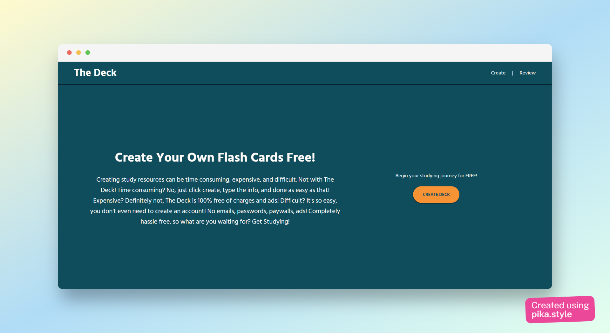
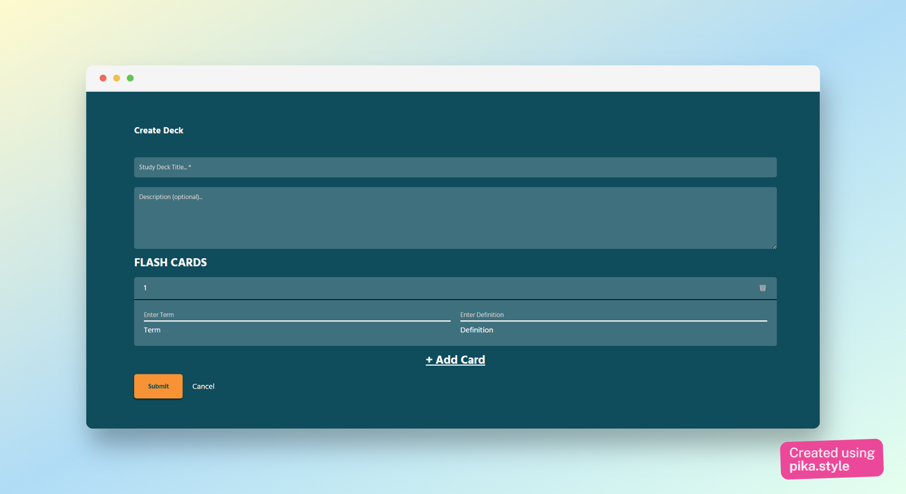
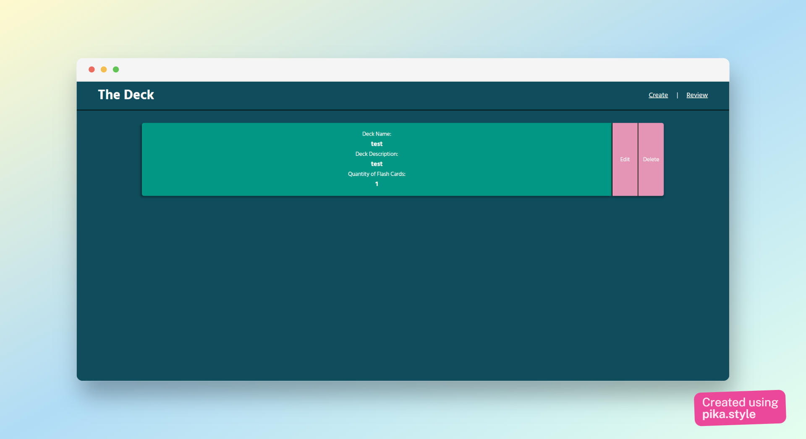

# Flashcard Website App [LIVE LINK](https://thedeck.netlify.app/)

## Problem
I made this site for a client who needed a flashcard system that's free because they didn't like Quizlet. 

## Goals
My goal for this app is to give the user the ability to create and study decks of flashcards. You can name the decks which will basically be like a stack of index cards. Each index card can be given their own term and definition to mimick the front and back of a real index card.

## Functionality
The site gives you the ability to create what's called a "deck" of flash cards for later review. You do this by clicking the 'Create' option in the nav bar, then press the yellow button which will automatically scroll you to the deck options. You can then review those decks' flashcards which will initially be displayed in the order you created them; However, there is a shuffle button so you can study in a randomized order to help refine your knowledge. Additionally, you can flip all cards if you prefer studying by matching a term to a definition. Required fields are 
* Deck Name
* Deck Description (optional)
* At least 1 Flash card title and definition

The decks that you create are initially saved in LocalStorage and can be exported in JSON format so your decks can pertain accross devices but will be saved to your device browser. I plan to add User Authentication later so each deck is saved to your account but for now, local storage works! You also have the ability to review decks by clicking 'Review' in your nav bar and from here you can mass edit your decks name, description, and each card in the deck as well as delete the deck. If you click on the deck, it will send you to a new page where the deck info is displayed along with the cards. All you need to do is click one of the cards and it will show the other side! There are extra buttons to shuffle the flashcards and to flip all flashcards.

## Future Plans
This project has grabbed more interest than I expected. Originally started to help a client study, I have plans to make the site better for sure! User authentication so the info persists accross devices is going to be a huge focus of mine. Later, I definitely plan on adding other ways to study such as: matching title to definition, filling in blanks, and an overall better flashcard experience. 

If you have any ideas, I would love to hear them so feel free to create a new issue or even contribute to this project!
